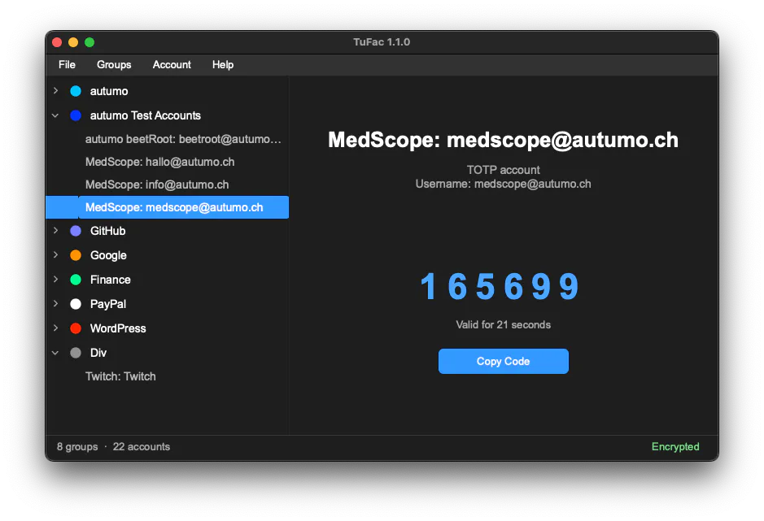

  
  <h1>TuFac</h1>

  Transfer your Google Authenticator codes from your phone to your Mac or PC.
  TuFac manages your two-factor accounts locally, generates the one-time codes
  directly on your device and never sends anything to the network.

  
  
  

    
  <a href="https://github.com/mikegasche/TuFac/issues">Issues</a> ·
  <a href="https://github.com/mikegasche/TuFac/blob/master/LICENSE">License</a>

## Features

- **Local & encrypted** — accounts are stored in an encrypted local file, never in the cloud
- **TOTP codes** — generates one-time passwords on the device with live countdown and one-click copy
- **Groups & accounts** — tree-based organization, drag & drop reordering, per-group colors
- **Google Authenticator import** — imports accounts from `otpauth-migration://` QR codes (screenshots or webcam) and migration QR images, multi-batch supported
- **Encrypted backup** — export/import backups protected by a passphrase (PBKDF2-derived key)
- **Flexible accounts** — SHA1/SHA256/SHA512/MD5, 6 or 8 digits, configurable period (30s default)
- **Dark theme** — consistent dark UI, native menus and shortcuts
- **Platforms** — macOS (Intel & Apple Silicon) and Windows, as standalone binaries

## Screenshot

  

## Download

TuFac is released as ready-to-run packages for **macOS** (Intel & Apple Silicon) and **Windows**.
Get the latest version from the [GitHub Releases](https://github.com/mikegasche/TuFac/releases) page:

| Platform | Package |
|----------|---------|
| Windows (x64) | `TuFac-<version>-windows-x64.exe` |
| macOS (Intel) | `TuFac-<version>-macos-x86_64.zip` |
| macOS (Apple Silicon) | `TuFac-<version>-macos-arm64.zip` |

### macOS

Unzip the archive and drag `TuFac.app` into your Applications folder.
The first time you open it, right-click the app and choose **Open** (macOS Gatekeeper).

### Windows

Run the `.exe` — no installation required.

## Usage

Create a group, add an account with its base32 secret, and select it to see the
current TOTP code with live countdown. Use **Copy Code** to copy it to the clipboard.

Import your existing accounts from Google Authenticator via **File → Import from QR Codes...**,
either from image files (`.png`, `.jpg`, `.jpeg`, `.webp`, `.bmp`) or scanned with your webcam.

## Import from Google Authenticator (Phone → Desktop)

Step by step guide for moving your existing Google Authenticator accounts into TuFac.

1. **Open Google Authenticator** on your phone.
2. Go to **Settings → Transfer accounts → Export accounts** (*Settings → Transfer Accounts → Export Accounts*).
3. Authenticator shows the export codes as QR codes, one screen at a time. **Screenshot every single one** — depending on how many accounts you have, this takes several images (e.g. 3).
4. **Transfer the screenshots to your computer**, e.g. via AirDrop or USB cable. Avoid sending them by e-mail or chat — the QR codes contain your secrets and should never leave your devices over a network.
5. In TuFac, open **File → Import from QR Codes...**.
6. **Select all the screenshot files at once**. TuFac reads every QR code from every image and automatically stitches split exports back together, regardless of the order.
7. TuFac creates a new group **"Imported Accounts"** containing all found accounts. (Google's HOTP entries are skipped — only TOTP accounts are imported.)
8. **Reorganize** the accounts as you like: right-click the selected accounts and choose *Create Group from N Account(s)*, or create a group via *Groups → New Group* and drag & drop the accounts into it.
9. **Optional:** color-code your groups — right-click a group → *Color → Set Color...* to pick a color, or *Remove Color* to reset it.

## License

TuFac is licensed under the GNU Affero General Public License v3.0 (AGPLv3) — see [LICENSE](LICENSE) for details.

 

Copyright &copy; 2026 Michael Gasche
